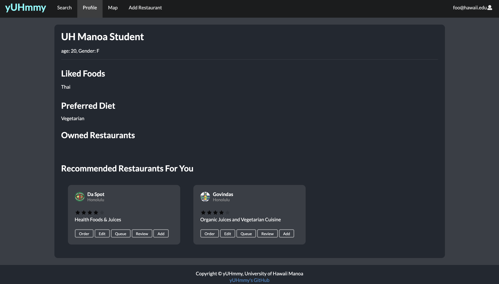

## Table of contents
***
* [Overview](#overview)
* [User Guide](#user-guide)
* [Developer Guide](#developer-guide)
* [Development History](#development-history)
* [The Developers](#contact-the-developers)
* [Community Feedback](#community-feedback)
* [About the Team](#about-us)
* [Acknowledgements](#acknowledgements)


## Overview
***
**GitHub organization associated with this project and all of its repositories:** <a href="https://github.com/yuhmmy">yUHmmy</a>

Never be hungry on campus again. It is a known fact that good restaurants and bars usually have long wait times in respect to service response time, and it is also a terrible idea to keep hungry people waiting. Our mobile point of sales platform eliminates the waiting game for customers by automating the process and putting it online, so if you have a mobile device you never have to wonder what restaurants are near you, or what food items are sold, and how much money you should bring. With the Covid-19 Pandemic among us, you may select what food items you would like to quickly pick up at restaurants.

* View available restaurants on campus and in the Manoa area
* View items on the menu, food descriptions, and prices at each location
* Search for the type of food you desire and find possible restaurants
* Order the food items that you are craving
* Create a profile page with food preferences and user information
* Rate restaurants with stars and provide your written feedback
* Integrated map functionality to discover top Manoa food locations
* Restaurant admin is notified of order and will bring food asap
* The "I'm feeling hungry" button suggests where to eat, based on your preferences
* Today’s top picks slideshow on homepage

At the completion of this project, the site will also provides code that implements a variety of useful design concepts, including:
* Use of Meteor Methods to illustrate how to simplify implementation of multiple collection updates.
* Use of Meteor Assets to initialize the database (helpful when initialization exceeds settings file size limits).
* A simple Filter page to illustrate how to perform simple queries on the database and display the results.
* Authentication using the built-in Meteor accounts package along with Sign Up and Sign In pages.
* Use of indexes to enforce uniqueness of certain fields in the collections, enabling them to serve as primary keys.

It illustrates various technologies useful to ICS software engineering students, including:

* [Meteor](https://www.meteor.com/) for Javascript-based implementation of client and server code.
* [React](https://reactjs.org/) for component-based UI implementation and routing.
* [Semantic UI React](https://react.semantic-ui.com/) CSS Framework for UI design.
* [Uniforms](https://uniforms.tools/) for React and Semantic UI-based form design and display.

### Approach
***
Users can find places to eat and order their food via a mobile device. The features above are intended to eliminate as much interaction between wait staff and customer, to prevent the possible spread of the virus. The goal is to make the customer feel like, their food appeared in front of them magically. This makes the ordering process less daunting and more convenient for both patrons and the business establishment.

## User Guide
***
This section provides a walkthrough of the yUHmmy user interface and its capabilities with up-to-date screen shots showing the state of the project. Note that some features are for admins or vendors only. Users must login for full site capabilities.

### [Landing Page](https://yuhmmy.meteorapp.com/#/)
The landing page is presented to users when they visit the top-level URL to the site. It is the first page that students view when they visit the site and provides an introduction to the capabilities of the site:


### [Registration Page](https://yuhmmy.meteorapp.com/#/signup)
The registration page is presented to users prompting new visitors to create an account on our site, in order to access the full features of our projects:


### [Login Page](https://yuhmmy.meteorapp.com/#/signin)
The login page is presented to users who already registered for an account, to access the site:


### [Search Page](https://yuhmmy.meteorapp.com/#/search)
The search page is presented to users so that they may see what restaurants are available near UH:


### [I'm Feeling Hungry](https://yuhmmy.meteorapp.com/#/search)
On the search page, user preferences are used to randomly generate a restaurant card that the user might enjoy eating at. This restaurant is one with currently available menu items that matches their prefered diet and prefered ethnic cuisine. Each time that the user presses the button, a new card appears, in coordination with their stated likes:


### [Menu Page via Search Page](https://yuhmmy.meteorapp.com/#/menu/1)
By clicking the order button on each menu card, users may view what food items are available for purchase at the restaurant, as well their prospective prices:


After clicking the checkout button, users are taken to the following page, which assures them that their items are being prepared:


### [Add Menu Item Page](https://yuhmmy.meteorapp.com/#/menu/1)
By clicking on their restaurant card, vendors can add fill out the form to add food items to their chosen selection of available menu items for that day:


### [Map Page](https://yuhmmy.meteorapp.com/#/review)
The restaurant map page is where users can use the map to find restaurants at and around UH Manoa:


### [Review Restaurant Page](https://yuhmmy.meteorapp.com/#/review)
The restaurant review page is where users provide their feedback to restaurants on how their eating experience was:


### [Profile Page](https://yuhmmy.meteorapp.com/#/profile)
The profile page is where users can see their preferences and information:


### [Restaurant Side Order Page](https://yuhmmy.meteorapp.com/#/restaurantorder)
The restaurant order page is presented to admins so that they may see what items have been ordered by the customers:


### [Add Restaurant Page](https://yuhmmy.meteorapp.com/#/add)
The restaurant order page is presented to admins so that they may add their restaurant to the site:


### [Edit Restaurant Page](https://yuhmmy.meteorapp.com/#/edit/3)
The restaurant order page is presented to admins so that they may edit their restaurant information on the site:


## Developer Guide
***
This section provides information of interest to Meteor developers wishing to use this code base as a basis for their own development tasks.

### Installation
First, [install Meteor](https://www.meteor.com/install).

Second, visit the [yUHmmy application github page](https://github.com/yuhmmy/yuhmmy), and click the "Use this template" button to create your own repository initialized with a copy of this application. Alternatively, you can download the sources as a zip file or make a fork of the repo.  However you do it, download a copy of the repo to your local computer.

Third, cd into the yuhmmy/app directory and install libraries with:

```
$ meteor npm install
```

Fourth, run the system with:

```
$ meteor npm run start
```

If all goes well, the application will appear at [http://localhost:3000](http://localhost:3000).


### Application Design
yUHmmy is based upon [meteor-application-template-react](https://ics-software-engineering.github.io/meteor-application-template-react/) and [meteor-example-form-react](https://ics-software-engineering.github.io/meteor-example-form-react/). Please use the videos and documentation at those sites to better acquaint yourself with the basic application design and form processing in yUHmmy.

## Initialization
The [config](https://github.com/bowfolios/yuhmmy/tree/master/config) directory is intended to hold settings files. The repository contains one file: config/settings.development.json.

This file contains default definitions for Profiles, Projects, and Interests and the relationships between them. Consult the walkthrough video for more details.

## Quality Assurance

### ESLint
yUHmmy includes a [.eslintrc](https://github.com/yuhmmy/yuhmmy/blob/master/app/.eslintrc) file to define the coding style adhered to in this application. You can invoke ESLint from the command line as follows:

```
meteor npm run lint
```

ESLint should run without generating any errors.

It's significantly easier to do development with ESLint integrated directly into your IDE (such as IntelliJ).

### From mockup to production
yUHmmy is meant to illustrate the use of Meteor for developing an initial proof-of-concept prototype. For a production application, several additional security-related changes must be implemented:

* Use of email-based password specification for users, and/or use of an alternative authentication mechanism.
* Use of https so that passwords are sent in encrypted format.
* Removal of the insecure package, and the addition of Meteor Methods to replace client-side DB updates.

## Development History

The development process for yUHmmy conformed to [Issue Driven Project Management](http://courses.ics.hawaii.edu/ics314s20/modules/project-management/) practices. In a nutshell:

* Development consists of a sequence of Milestones.
* Each Milestone is specified as a set of tasks.
* Each task is described using a GitHub Issue, and is assigned to a single developer to complete.
* Tasks should typically consist of work that can be completed in 2-4 days.
* The work for each task is accomplished with a git branch named "issue-XX", where XX is replaced by the issue number.
* When a task is complete, its corresponding issue is closed and its corresponding git branch is merged into master.
* The state (todo, in progress, complete) of each task for a milestone is managed using a GitHub Project Board.

The following sections document the development history of yUHmmy.

### Milestone 1: Mockup development
The goal of Milestone 1 was to create a set of HTML pages providing a mockup of the pages in the system.

**M1 Project page, showing what issues were completed:** <a href="https://github.com/yuhmmy/yuhmmy/projects/1">yUHmmy M1 Project Page</a>


### Milestone 2: Data model development 
The goal of Milestone 2 is to implement the data model: the underlying set of Mongo Collections and the operations upon them that would support the yUHmmy application.

**M2 Project page, showing what issues were completed:** <a href="https://github.com/yuhmmy/yuhmmy/projects/2">yUHmmy M2 Project Page</a>


### Milestone 3: Final Touches
The goal of Milestone 3 was to clean up the code base and fix minor UI issues.

**M3 Project page, showing what issues were completed:** <a href="https://github.com/yuhmmy/yuhmmy/projects/4">yUHmmy M3 Project Page</a>


**Running deployment of our system on Galaxy:** <a href="https://yuhmmy.meteorapp.com/">yUHmmy on Galaxy</a>
* note: our Galaxy subscription ends the night of 05/13/2020

### Community Feedback
***
We asked five UH community members (not from ICS 314) to try out our system on Meteor (before the subscription ended and prior to final touches) This is the feedback they provided:

"This website is a good competitor to delivery services such as UberEats and DoorDash. It has the same functions as these services. I can see when my food is being prepared and finished. I can also see some of the nearest restaurants and food places in my area. One of the cool things I like about the website is that there is a tab where I can see google maps. Here, I can have a birds eye view of the restaurants near me and I can see the website associated with the restaurant. They also include on-campus food trucks. 5 star" -DM

"I like the layout, it is generally understandable. However, some of the functions are confusing. I liked the map, how you order and the landing page. I think you should make it so you have a page to display all of my orders from any location. Overall, it is very sleek and would use it if polished. Also, I would need a place to input my money data, so probably a secure transation thing a ma bob." -WC

"The website was nice and organized.  The UI was smooth and easy to use.  I liked the order page where it tells you the status of your food." - TY

"The website was awesome and had many food options to choose from.  A variety of food places that range from UH campus to local favorites that are around the area. DAH BEST FOOD APP. CHEEHOO!" FG

"In general, I think the UI is pretty clean although not entirely intuitive. 3/10." - KL

## Contact The Developers
***
We are a team of UH Manoa students currently enrolled in ICS 314!
* [Keenan Lee](https://knolee.github.io/)
* [ZJ Lin](https://z-j-lin.github.io/)
* [Tina Loos](https://tinaloos.github.io/)
* [Spencer Young](https://spjy.github.io/)


## About Us
### [Keenan Lee](https://knolee.github.io/)

**What do you want to get out of this final project (besides the obvious, which is a good grade for the course)? Are there any skills you want to practice or improve at through this project experience?**

I would like to improve my typing speed.

**What is your background? What skills can you bring to the final project?**

I had no prior knowledge of web development before starting this class.

**What are your time constraints? When are you available to meet? When do you plan to be able to work on the project?
How do you prefer to be contacted? Email? Text? Slack? When do you want to be contacted? When do you not want to be contacted?**

I am mostly free during the evening (after 6) on weekdays. I am available all day on weekends.
Email, text, or discord are all ok with me

### [ZJ Lin](https://z-j-lin.github.io/)

**What do you want to get out of this final project (besides the obvious, which is a good grade for the course)? Are there any skills you want to practice or improve at through this project experience?**

I would like to become better at finishing things early. I would like to adopt the concept of early is on time, on time is late.

**What is your background? What skills can you bring to the final project?**

I have some prior project management skills. I'm good at telling people to do stuff, but its not my most favorite job in the world.  I code mostly in python, I hate C or C++ but I will do it if I have to.

**What are your time constraints? When are you available to meet? When do you plan to be able to work on the project?**

I'm usually available at night, but sometimes I'm pressed with other homework due dates. Weekends are great for me. 

**How do you prefer to be contacted? Email? Text? Slack? When do you want to be contacted? When do you not want to be contacted?**

Please contact me on discord. On anything else I might unintentionally ignore you.

### [Tina Loos](https://tinaloos.github.io/)

**What do you want to get out of this final project (besides the obvious, which is a good grade for the course)? Are there any skills you want to practice or improve at through this project experience?**

I desire to sharpen my coding skills and collaboratively work as a team to create a meaningful final project. In addition to improving my knowledge of software engineering concepts such as user interface and application design, frameworks, quality assurance, configuration and project management, and enhance my ability to deploy applications. I hope to take my understanding of the information that we learned throughout this course and apply it to our project. 

**What is your background? What skills can you bring to the final project?**

I am a Junior majoring in Computer Science with some previous project management skills. Through courses taken at UHM, I learned how to code in JavaScript, HTML, Java, and C/C++. Outside of this class, I worked in a team using SquareSpace (pre-built templates / drag and drop elements) to design two websites.

**What are your time constraints? When are you available to meet? When do you plan to be able to work on the project?**

I am available to virtually meet on the weekends and every evening during the week (except Wednesday because of my work as a ICS tutor). I plan to be able to work on this project every day, during the break times that I have between work, Zoom courses, and assignments. 

**How do you prefer to be contacted? Email? Text? Slack? When do you want to be contacted? When do you not want to be contacted?**

All methods of contact work for me, as I get notifications for school related messages on every medium of communication (Email, Text, Slack, Discord). You may contact me at any time.

### [Spencer Young](https://spjy.github.io/)

**What do you want to get out of this final project (besides the obvious, which is a good grade for the course)? Are there any skills you want to practice or improve at through this project experience?**

From this project, I would like to learn about and implement user experience design and how to incorporate it into the user interface for websites. In addition, I would also like to improve my communication skills by learning to express myself succinctly and sensibly.

**What is your background? What skills can you bring to the final project?**

I am a senior in computer engineering attending the University of Hawaii at Manoa. I am familiar with the big picture since I have experience in both backend (creating/interfacing with middleware, APIs, databases) and frontend (HTML, CSS, JavaScript, frontend frameworks) from both self-learning projects and work.

**What are your time constraints? When are you available to meet? When do you plan to be able to work on the project?
How do you prefer to be contacted? Email? Text? Slack? When do you want to be contacted? When do you not want to be contacted?**

I am for the most part available on on Tues, Thurs and the weekend and plan to work on the project those days. MWF are tight since I have a spread out schedule throughout the day. Regarding communication mediums, I prefer email, text or Discord and can be contacted any time

## Acknowledgements

Mahalo nui loa to [Phillip Johnson](https://github.com/philipmjohnson) for the knowledge on software engineering and guidance that was provided thoughout the semester, as well as documentation formatting.
