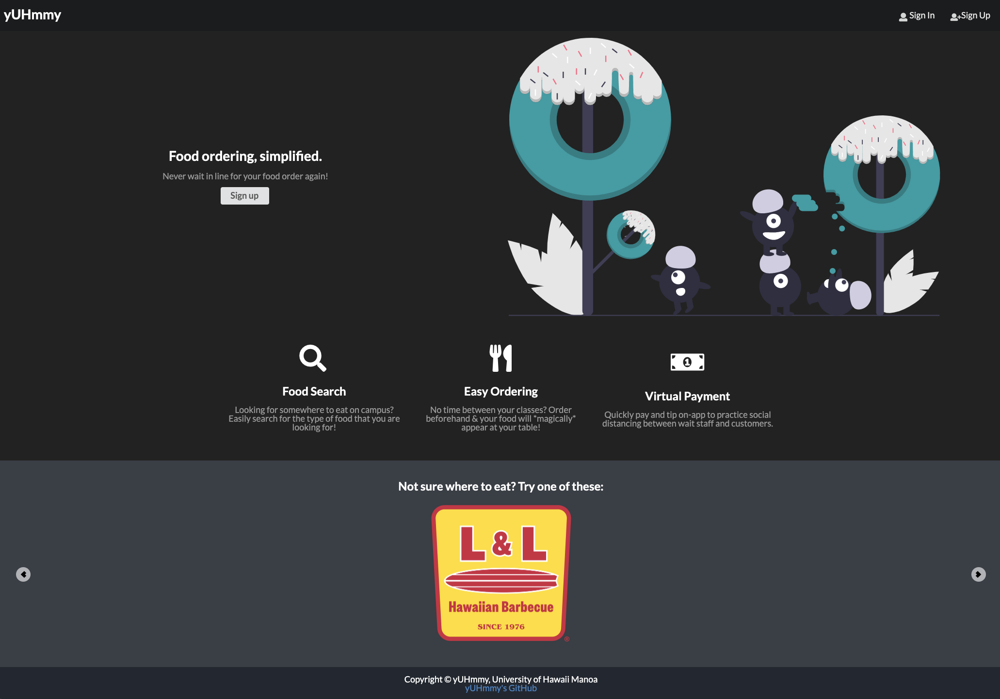
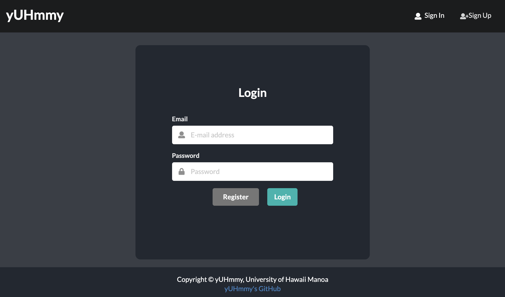

## yUHmmy
## Table of contents
***
* [Overview](#overview)
* [User Guide](#user-guide)
* [Developer Guide](#developer-guide)
* [Development History](#development-history)
* [The Developers](#contact-the-developers)
* [About the Team](#about-us)
* [Acknowledgements](#acknowledgements)
* [Coming Soon](#coming-soon)

## Overview
***
**GitHub organization associated with this project and all of its repositories:** <a href="https://github.com/yuhmmy">yUHmmy</a>

It is a known fact that good restaurants and bars usually have long wait times in respect to service response time, and it is also a terrible idea to keep hungry people waiting. Our mobile point of sales platform eliminates the waiting game for customers by automating the process and putting it online, so if you have a mobile device you never have to track down a waitress ever again, or awkwardly try to get the bartenders attention at Manoa Gardens. Furthermore as long as the customer has a debit card on their account they can pay for their services and tip and waitress without even reaching for their wallet. This makes the ordering process less daunting and more convenient for both patrons and the business establishment.

It illustrates various technologies useful to ICS software engineering students, including:

* [Meteor](https://www.meteor.com/) for Javascript-based implementation of client and server code.
* [React](https://reactjs.org/) for component-based UI implementation and routing.
* [Semantic UI React](https://react.semantic-ui.com/) CSS Framework for UI design.
* [Uniforms](https://uniforms.tools/) for React and Semantic UI-based form design and display.

### Approach
***
This project is similar to GrubHub such that users can order and pay for food on their mobile device and similarity ends there, the following is a list of things that make our platform great:
* Order and have your food brought to your table eliminating multiple trips for wait staff
* The users can set limits on spending so they don’t overspend.
* Order drinks or request services in restaurants
The features above is intended to eliminate as much interaction between wait staff and customer. The goal is to make the customer feel like, their food appeared in front of them magically. This also allow the restaurant to spend more of their man power moving goods since that is what makes the money.

## User Guide
***
This section provides a walkthrough of the yUHmmy user interface and its capabilities with up-to-date screen shots showing the state of the project, Click on the titles to link to the same pages running on Galaxy!

### [Landing Page](https://yuhmmy.meteorapp.com/#/)
The landing page is presented to users when they visit the top-level URL to the site. It is the first page that students view when they visit the site and provides an introduction to the capabilities of the site:


### [Registration Page](https://yuhmmy.meteorapp.com/#/signup)
The registration page is presented to users prompting new visitors to create an account on our site, in order to access the full features of our projects:


### [Login Page](https://yuhmmy.meteorapp.com/#/signin)
The login page is presented to users who already registered for an account, to access the site:


### [Menu Page](https://yuhmmy.meteorapp.com/#/menu)
The menu page is presented to users so that they may see what food items are available for purchase, as well their prospective prices:


### [Restaurant Order Page](https://yuhmmy.meteorapp.com/#/order)
The restaurant order page is presented to admins so that they may see what items have been ordered by the customers:


## Development History

The development process for yUHmmy conformed to [Issue Driven Project Management](http://courses.ics.hawaii.edu/ics314s20/modules/project-management/) practices. In a nutshell:

* Development consists of a sequence of Milestones.
* Each Milestone is specified as a set of tasks.
* Each task is described using a GitHub Issue, and is assigned to a single developer to complete.
* Tasks should typically consist of work that can be completed in 2-4 days.
* The work for each task is accomplished with a git branch named "issue-XX", where XX is replaced by the issue number.
* When a task is complete, its corresponding issue is closed and its corresponding git branch is merged into master.
* The state (todo, in progress, complete) of each task for a milestone is managed using a GitHub Project Board.

The following sections document the development history of yUHmmy.

### Milestone 1: Mockup development
The goal of Milestone 1 was to create a set of HTML pages providing a mockup of the pages in the system.

**Running deployment of our system on Galaxy:** <a href="https://yuhmmy.meteorapp.com/">yUHmmy on Galaxy</a>

**M1 Project page, showing what issues were completed:** <a href="https://github.com/yuhmmy/yuhmmy/projects/1">yUHmmy M1 Project Page</a>


### Milestone 2: Data model development 
The goal of Milestone 2 is to implement the data model: the underlying set of Mongo Collections and the operations upon them that would support the yUHmmy application.

**M2 Project page, showing what issues are to be addressed and completed:** <a href="https://github.com/yuhmmy/yuhmmy/projects/2">yUHmmy M2 Project Page</a>


## Contact The Developers
***
We are a team of UH Manoa students currently enrolled in ICS 314!
* [Keenan Lee](https://knolee.github.io/)
* [ZJ Lin](https://z-j-lin.github.io/)
* [Tina Loos](https://tinaloos.github.io/)
* [Spencer Young](https://spjy.github.io/)

## Developer Guide
***
This section provides information of interest to Meteor developers wishing to use this code base as a basis for their own development tasks.

### Installation
First, [install Meteor](https://www.meteor.com/install).

Second, visit the [yUHmmy application github page](https://github.com/yuhmmy/yuhmmy), and click the "Use this template" button to create your own repository initialized with a copy of this application. Alternatively, you can download the sources as a zip file or make a fork of the repo.  However you do it, download a copy of the repo to your local computer.

Third, cd into the yuhmmy/app directory and install libraries with:

```
$ meteor npm install
```

Fourth, run the system with:

```
$ meteor npm run start
```

If all goes well, the application will appear at [http://localhost:3000](http://localhost:3000).


### Application Design
yUHmmy is based upon [meteor-application-template-react](https://ics-software-engineering.github.io/meteor-application-template-react/) and [meteor-example-form-react](https://ics-software-engineering.github.io/meteor-example-form-react/). Please use the videos and documentation at those sites to better acquaint yourself with the basic application design and form processing in yUHmmy.

### Data model
## Initialization
The [config](https://github.com/bowfolios/yuhmmy/tree/master/config) directory is intended to hold settings files. The repository contains one file: config/settings.development.json.

This file contains default definitions for Profiles, Projects, and Interests and the relationships between them. Consult the walkthrough video for more details.

## Quality Assurance

### ESLint
yUHmmy includes a [.eslintrc](https://github.com/yuhmmy/yuhmmy/blob/master/app/.eslintrc) file to define the coding style adhered to in this application. You can invoke ESLint from the command line as follows:

```
meteor npm run lint
```

ESLint should run without generating any errors.

It's significantly easier to do development with ESLint integrated directly into your IDE (such as IntelliJ).


### Coming Soon
***
#### Milestone 2: Completed

#### Community Feedback
We are interested in your experience using yUHmmy!
#### Milestone 3: Final Touches
The goal of Milestone 3 is to clean up the code base and fix minor UI issues.

#### Walkthrough Videos (Coming Soon)
yUHmmy is intended as a model of how an ICS 314 project could be organized and executed. There will be several videos that walks you through various aspects of the system

#### Example Enhancements

After implementing the basic functionality, here are ideas for more advanced features:

* Restaurant Suggestions based on previous orders using machine learning
* Able to provide party hot spots based on number of people at restaurants or bars
* Ratings and reviews for restaurants
* Give alerts for new menu items
* Suggest restaurants based on budgets


## About Us
### [Keenan Lee](https://knolee.github.io/)

**What do you want to get out of this final project (besides the obvious, which is a good grade for the course)? Are there any skills you want to practice or improve at through this project experience?**

I would like to improve my typing speed.

**What is your background? What skills can you bring to the final project?**

I had no prior knowledge of web development before starting this class.

**What are your time constraints? When are you available to meet? When do you plan to be able to work on the project?
How do you prefer to be contacted? Email? Text? Slack? When do you want to be contacted? When do you not want to be contacted?**

I am mostly free during the evening (after 6) on weekdays. I am available all day on weekends.
Email, text, or discord are all ok with me

### [ZJ Lin](https://z-j-lin.github.io/)

**What do you want to get out of this final project (besides the obvious, which is a good grade for the course)? Are there any skills you want to practice or improve at through this project experience?**

I would like to become better at finishing things early. I would like to adopt the concept of early is on time, on time is late.

**What is your background? What skills can you bring to the final project?**

I have some prior project management skills. I'm good at telling people to do stuff, but its not my most favorite job in the world.  I code mostly in python, I hate C or C++ but I will do it if I have to.

**What are your time constraints? When are you available to meet? When do you plan to be able to work on the project?**

I'm usually available at night, but sometimes I'm pressed with other homework due dates. Weekends are great for me. 

**How do you prefer to be contacted? Email? Text? Slack? When do you want to be contacted? When do you not want to be contacted?**

Please contact me on discord. On anything else I might unintentionally ignore you.

### [Tina Loos](https://tinaloos.github.io/)

**What do you want to get out of this final project (besides the obvious, which is a good grade for the course)? Are there any skills you want to practice or improve at through this project experience?**

I desire to sharpen my coding skills and collaboratively work as a team to create a meaningful final project. In addition to improving my knowledge of software engineering concepts such as user interface and application design, frameworks, quality assurance, configuration and project management, and enhance my ability to deploy applications. I hope to take my understanding of the information that we learned throughout this course and apply it to our project. 

**What is your background? What skills can you bring to the final project?**

I am a Junior majoring in Computer Science with some previous project management skills. Through courses taken at UHM, I learned how to code in JavaScript, HTML, Java, and C/C++. Outside of this class, I worked in a team using SquareSpace (pre-built templates / drag and drop elements) to design two websites.

**What are your time constraints? When are you available to meet? When do you plan to be able to work on the project?**

I am available to virtually meet on the weekends and every evening during the week (except Wednesday because of my work as a ICS tutor). I plan to be able to work on this project every day, during the break times that I have between work, Zoom courses, and assignments. 

**How do you prefer to be contacted? Email? Text? Slack? When do you want to be contacted? When do you not want to be contacted?**

All methods of contact work for me, as I get notifications for school related messages on every medium of communication (Email, Text, Slack, Discord). You may contact me at any time.

### [Spencer Young](https://spjy.github.io/)

**What do you want to get out of this final project (besides the obvious, which is a good grade for the course)? Are there any skills you want to practice or improve at through this project experience?**

From this project, I would like to learn about and implement user experience design and how to incorporate it into the user interface for websites. In addition, I would also like to improve my communication skills by learning to express myself succinctly and sensibly.

**What is your background? What skills can you bring to the final project?**

I am a senior in computer engineering attending the University of Hawaii at Manoa. I am familiar with the big picture since I have experience in both backend (creating/interfacing with middleware, APIs, databases) and frontend (HTML, CSS, JavaScript, frontend frameworks) from both self-learning projects and work.

**What are your time constraints? When are you available to meet? When do you plan to be able to work on the project?
How do you prefer to be contacted? Email? Text? Slack? When do you want to be contacted? When do you not want to be contacted?**

I am for the most part available on on Tues, Thurs and the weekend and plan to work on the project those days. MWF are tight since I have a spread out schedule throughout the day. Regarding communication mediums, I prefer email, text or Discord and can be contacted any time

## Acknowledgements

Mahalo nui loa to [Phillip Johnson](https://github.com/philipmjohnson) for the knowledge on software engineering and guidance that was provided thoughout the semester, as well as documentation formatting.
